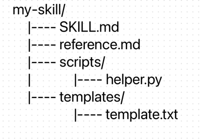
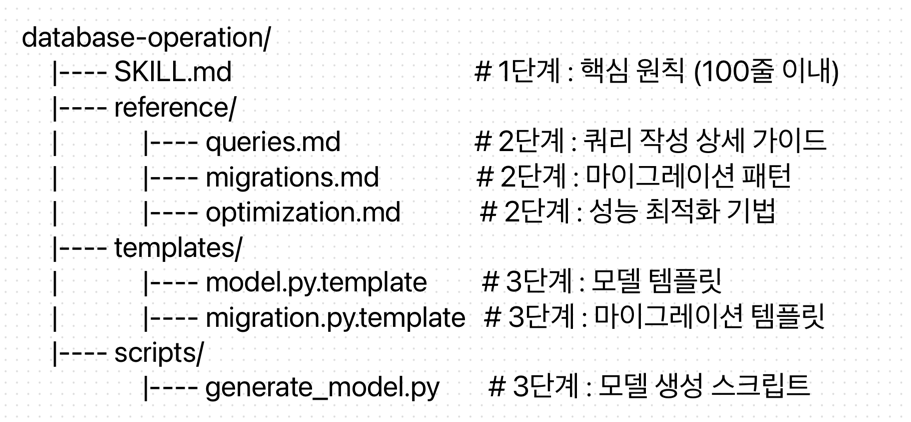

# Chapter 03 에이전트 스킬

## 3-1 클로드 스킬의 개념과 구조
- 스킬은 클로드의 기능을 확장하는 지식 모듈로, 스킬별 SKILL.md 지침 파일과 선택적 지원 파일(스크립트, 템플릿 등)로 구성

### 1) 컨텍스트 윈도우는 공용자산이다.
- 스킬 설계의 철학
- 유용한 지식과 패턴을 공유 가능한 형태로 캡슐화하여 팀 전체 또는 커뮤니티가 함께 활용할 수 있어야 한다. 
- 개인이 축적한 노하우와 모범 설계를 스킬로 정리해 공유하면 다른 사람도 동일한 수준의 지원을 받을 수 있다. 

### 2) 스킬의 유형
- 개인 스킬 
  - ~/.claude/skills 디렉토리 위치
  - 해당 개발자의 모든 프로젝트에서 사용 가능
  - 개인적인 워크플로나 실험적 기능을 개발할 때 적합
- 프로젝트 스킬 
  - 프로젝트 루트의 .claude/skilss/ 디렉토리에 저장
  - 저장소에 포함되어 팀과 공유되며 자동 배포가 가능
  - 팀 단위의 표준 워크플로나 프로젝트 특화 기능을 정의할 때 사용
- 플러그인 스킬 
  - 클로드 코드 플러그인과 함께 번들되어 배포되는 형태 
  - 플러그인 마켓플레이스를 통해 설치하고 바로 사용 가능

#### 스킬 디렉토리 기본 구조

- SKILL.md 파일은 필수 파일
- 나머지 스킬의 복작도에 따라 선택적으로 포함

### 3) SKILL.md 파일 구조
- YAML 프론트매터와 마크다운 본문으로 구성, 200자 이내 유지
- **단일 책임 원칙**을 따라야한다. 

| 필드            | 필수 여부                             | 설명                                                        |
|---------------|-----------------------------------|-----------------------------------------------------------|
| name          | 선택                                | 소문자, 영숫자, 하이픈만 사용 생략하면 디렉터리 이름을 스킬 이름으로 사용 최대 65자 |
| description   | 필수 | 기능과 사용 트리거 설명 최대 1024자                                |
| allowed-tools | 선택                                | 스킬 활성화 시 사용 가능한 도구 목록                                     |
| model         | 선택                                | 스킬 실행시 사용할 모델 지정                                          |
| context       | 선택                                | 추가 컨텍스트 설정                                                |
| agent         | 선택                                | 서브 에이전트 관리                                                |

- name 필드는 스킬이 수행하는 행위를 명확하게 드러낼 수 있는 동명사 형태를 권장
  - commit-helper보단 generating-commit-messages가 적절
- description 필드는 기능과 사용 트리거를 모두 포함해아한다. 
  - 클로드가 사용자 요청을 분석할 때 이 필드를 참조하여 해당 스킬을 활성화할지 결정 

### 4) 세 단계 점진적 작동 방식
- 스킬은 세 가지 유형의 콘텐츠를 단계적으로 로드하여 필요하지 않은 컨텐츠가 컨텍스트 윈도우를 선점하는것을 방지한다. (점진적 공개)
- 클로드를 시작할 때 1단계 메타데이터 레벨을 자동으로 로딩하는데 필수 필드인 name과 description이 여기에 속한다. 
- 2단계는 사용자의 요청이 특정 스킬의 description 필드와 매칭되면 Bash를 통해서 SKILL.md를 컨텍스트 윈도우에 추가한다. 
- 3단계는 리소스와 코드레벨이며 SKILL.md 외부의 지원 파일이 여기에 속하며 추가 마크다운 문서는 전문화된 가이드와 워크플로를 담으며 실행가능한 스크립트는 Bash를 통해 실행되어 결정론적 작업을 수행한다. 
- 이 세가지 유형이 각기 다른 시점에 로드되기 때문에 간단한 작업에는 최소한의 컨텍스트만 사용하면서도 복잡한 작업에는 필요한 모든 리소스를 제공할 수 있다. 

### 5) 도구 접근 권한 제한
- 프론트매터의 allowed-tools 필드로 스킬을 활성화할 때 클로드가 사용하는 도구를 제한할 수 있다. 

## 3-2 스킬 사용과 개발
### 1) 스킬 목록과 스킬 조합
- 사용할 수 있는 스킬을 알려면 클로드에게 직접 요청하면 된다. 
- 복잡한 작업을 수행할 떄는 여러 스킬을 조합하여 사용할 수 있다. 

### 2) 커스텀 스킬 개발
- 스킬 정의, 디렉터리 생성, md 파일 작성, 지원 파일 추가의 순서를 따른다
- 1. 스킬의 목적과 범위를 명확히 정의한다. 어떤 작업을 지원하고 언제 활성화 할건지, 어떤 도구가 필요한지를 결정한다.
- 2. mkdir -p ~/.claude/skills/<스킬명>과 같은 명령으로 스킬 디렉터리를 생성한다. 
- 3. SKILL.md 파일을 작성한다. name과 description을 정의하고 본문에 구체적인 지침을 작성한다. 
- 4. 지원파일을 추가한다. 스킬이 복잡하면 reference.md에 상세 레퍼런스를 작성하고. scripts/ 디렉터리에 헬퍼 스크립트를, templates/ 디렉토리에 코드 템플릿을 배치한다. SKILL.md에서 이 파일을 상대 링크로 참조하면 필요할 때 클로드가 점진적으로 파일을 로드한다.  

### 3) 스킬에서 환각 방지 지침 작성
- 스킬을 작성할때는 환각을 방지하는 장치를 마련해야한다.
- 환각은 존재하지 않는 API를 호출하는코드, 잘못된 라이브러리 버전 정보, 부정확한 설정값 등 다양한 형태로 나타난다.
- 1. 불확실성 표현 허용 지침 : 클로드가 불확실성을 인정하고 '모르겠다'라고 대답하도록 명시적으로 허용
- 2. 지식 범위 제한 지침 : 클로드가 참조할 수 있는 정보의 범위를 명확히 제한한다. 
- 3. 출처 명시 지침 : 정보의 출처를 명시하도록 지침을 작성하면 사용자가 정보의 신뢰성을 직접 검증 할 수 있다. 

### 4) 코드 실행 통합
- 스킬은 scripts/ 디렉토리를 통해 실행 가능한 코드와 통합될 수 있다. 
- 스크립트는 클로드가 토큰을 소비하지 않고 결정론적으로 처리해야 하는 작업에 적합하다. 

### 5) 테스트와 검증 방법
- 먼저 설명과 일치하는 질문을 하여 스킬이 활성화 되는지 확인하고 스킬이 활성화 되지 않는다면 다음 사항을 확인한다. 
  - decription이 구체적인지 확인
  - 스킬 디렉토리 경로 확인
  - YAML 유효성 검사
  - 디버그 모드를 활용, claude --debug를 실행하여 스킬 로딩 문제를 확인

## 3-3 스킬 고급 사용과 최적화 
### 1) 동적 스킬 로딩 패턴
- 스킬은 세 단계 점진적 작동 방식을 따른다고 했는데 이를 동적 로딩 패턴이라고 한다. 

- SKILL.md에서는 각 레퍼런스 파일의 링크와 함께 언제 해당 파일을 참조해야하는지 명시한다.
- 이렇게 하면 클로드가 현재 작업에 필요한 정보만 선택적으로 로드할 수 있다. 

### 2) 스킬 성능 최적화
- 1. 정보 밀도 향상 : 동일한 내용을 더 적은 토큰으로 전달할 수 있다면, 컨텍스트 윈도우를 더 효율적으로 사용 가능
- 2. 조건부 로딩 : 모든 정보를 한 번에 로드하는 대신 작업 유형에 따라 필요한 정보만 로드하도록 구성
- 3. 캐싱 고려 : 자주 사용되는 정보는 SKILL.md에 직접 포함하고, 드물게 사용되는 정보는 별도 파일로 분리한다. 

### 3) 스킬 버전 관리
- 스킬이 진화함에 따라 변경 이력을 추적하고 필요시에는 이전 버전으로 롤백할 수 있어야 하므로 버전을 관리해야한다. 
- SKILL.md 콘텐츠 내에 Version History 섹션을 포함하여 변경사항을 문서화하는 것을 권장한다. 

### 4) 팀 스킬 개발
- 팀스킬은 프로젝트의 저장소의 .claude/skills/ 디렉터리에 저장하고 깃으로 관리한다. 
- 팀스킬을 개발할때는 다음과 같은 원칙을 따른다
  - 표준화된 구조를 따른다. 팀 내 모든 스킬이 동일한 디렉토리 구조와 파일 명명 규칙을 따르면 새팀원도 기존 스킬을 쉽게 이해하고 기여할 수 있다.
  - 리뷰 프로세스를 도입한다. 코드 리뷰처럼 스킬 변경도 리뷰를 거친다. 
  - 피드백을 수집하고 반영한다. 스킬이 예상대로 활성화 되지 않거나 지침이 불명확한 경우 등 실사용에서 발견되는 문제를 수집하여 반영한다. 

### 5) 디버깅 기법
- claude --debug 명령을 사용하면 스킬 로딩 과정에서 발생하는 문제를 확인할 수 있다.
- 디버그 모드에서는 어떤 스킬이 로드되고 로딩 중 어떤 오류가 있었는지 등의 정보가 출력된다. 
- ~/.claude/debug 디렉토리에 세션별로 저장된다. 

### 6) 재사용 가능한 스킬 패턴
- 스킬을 재사용 가능하도록 설계하면 개발 효율성이 크게 향상된다. 
- 재사용성이 높은 스킬은 세가지 특징을 가진다
  - 특정 프로젝트나 기술 스택에 종속되지 않고 일반적인 패턴을 다룬다. 
  - 다양한 상황에 적용할 수 있도록 description에 충분한 트리거 조건을 포함한다. 
  - 명확한 체크리스트와 단계별 지침을 가져 다른 스킬과 조합하기 쉽다. 

### 7) 스킬의 격리 실행 : context: fork 메커니즘
- 스킬 시스템의 기본 동작 방식은 부모 대화의 컨텍스트 안에서 스킬이 활성화 되는 것이다. 
- 대규모 코드베이스 분석처럼 많은 토큰을 소비하는 작업이 부모 대화의 컨텍스트 윈도우를 잠식하거나, 중간 결과물이 이후 대화의 품질을 저하하는 경우 격리 실행이 필요하다.
- context: fork는 이 문제들을 해결하기 위해 프론트매터에서 사용하는 필드
- context: fork가 설정된 스킬은 부모 대화로부터 완전히 분리된 서브 에이전트에서 실행, 작업이 완료되면 결과만 부모 대화에 전달 

#### context: fork를 적용하기 적합한 경우
- 1. 대규모 코드베이스 분석
- 2. 세션 격리가 필요한 워크플로
- 3. 도구 전문화 기반의 분석 작업. ast-grep 같은 구조적 검색 도구를 활용한 코드 분석 스킬은 포크된 Explore 에이전트에서 실행하는 것이 적합하다. 

즉, 이 기능을 통해 Skill은 서브 에이전트의 격리된 컨텍스트를 활용하면서도 스킬 고유의 자동 발견과 동적 활성화 장점을 그대로 유지할 수 있다. 
