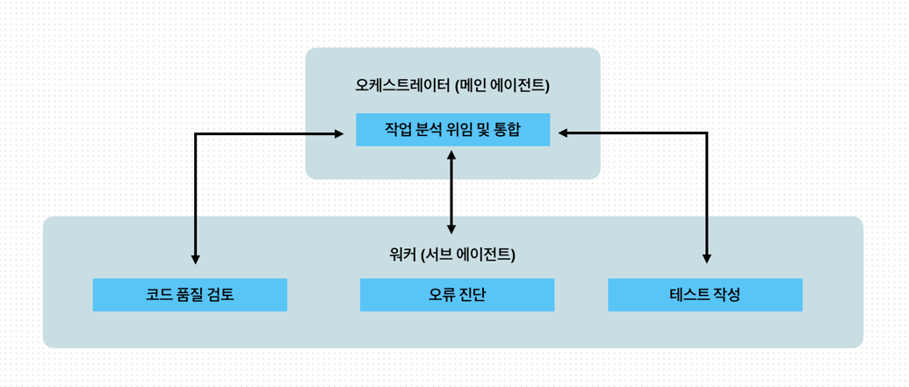
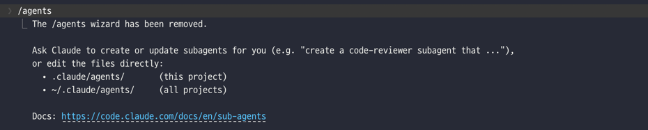
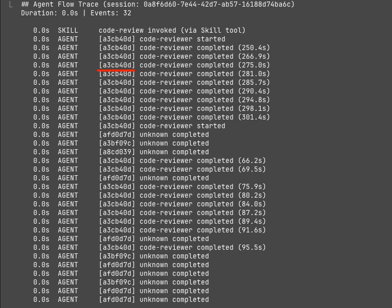

# 4. 서브 에이전트

## 4-1 서브에이전트의 개념과 아키텍처
- 클로드 코드의 Agent 도구를 기반으로 호출되는 특화된 AI 어시스턴트
- 각 서브 에이전트는 자체 컨텍스트 윈도우, 커스텀 시스템 프롬프트, 할당된 도구를 가지고 있음
- 여러 서브 에이전트에 각각 다른 모듈을 분석하도록 위임하면 핵심 결과만 메인 대화로 반환
```aiignore
# 서브에이전트 MD파일 저장 위치
- 사용자 범위 : ~/.claude/agents/ 모든 프로젝트에서 사용 가능
- 프로젝트 범위 : .claude/agents/ 해당 프로젝트 전용, 팀과 공유 가능
```
### 1) 에이전트 위임 패턴: 오케스트레이터 (메인 에이전트) - 워커 (서브 에이전트)
 - 오케스트레이터(Orchestrator)는 여러 개의 복잡한 작업, 서비스, 또는 AI 에이전트를 조율하고 관리하는 시스템이나 소프트웨어
 - 오케스트레이터의 핵심 역할은 **작업 분배**와 **결과 통합**

 - 관련 정보만 오케스트레이터에 반환하고 되어 핵심 요약 사항만 정리하여 정제된 정보를 유지할 수 있다.

### 2) 단일 책임 원칙과 서브에이전트
- 스킬에서 적용했던 단일 책임 원칙은 서브에이전트 설계에서도 동일하게 적용되며 각 서브에이전트는 하나의 명확한 책임만을 가져야 한다.
- 한 에이전트가 여러 역할을 담당하면 프롬프트가 복잡해지고 예측 가능성이 떨어짐

### 3) 에이전트 체인과 병렬 실행
- 서브에이전트는 순차적으로 체인을 구성하거나 병렬로 실행할 수 있다.
  - 순차 실행 : 이전 에이전트의 결과가 다음 에이전트의 입력이 되는 파이프라인 구조
  - 병렬 실행 : 독립적인 작업을 동시에 처리할 때(여러 모듈을 사용) 유용, 전체 에이전트 시간을 단축시킬수 있고 각 에이전트가 서로의 컨텍스트를 오염시키지 않도록 보장
- 에이전트 체인을 설계할때 중간단계에서 실패했을때 처리 방법도 고려해야하며 치명적인 실패는 파이프라인을 중단하고 오류를 보고 해야한다. 

**다중 클로드 워크플로** (실제 개발팀 협업 방식과 유사한 패턴)
- 여러 클로드 코드 인스턴스를 병렬로 서로 다른 터미널에서 실행하여 복잡한 작업을 처리하는 고급 패턴
- 하나의 인스턴스는 코드를 작성, 다른 하나의 인스턴스는 리뷰 수행 등 대규포 프로젝트에서 개발 속도를 높이고 품질을 개선하는데 효과적이다.

### 4) 언제 서브에이전트를 사용하는가
- 1) 작업의 복잡도 : 단순한 파일 수정이나 짧은 코드 생성은 메인 대화에서 직접 처리하는것이 효율적, 여러 파일에 걸친 분석이나 장시간 실행되는 작업은 서브에이전트에 위임
- 2) 컨텍스트 소모량 : 작업 수행에 대규모 파일 읽기나 명령 실행이 필요하다면 서브에이전트 사용을 고려
- 3) 전문성 요구 수준 : 특정 도메인에 대한 상세한 지침이 필요한 작업은 해당 지침으로 구성된 서브 에이전트를 활용
- 단순작업은 메인, 대규모 작업이나 장시간 작업 등은 서브 

## 4-2 서브에이전트 사용하기 
### 1) 사용 가능한 서브에이전트 목록
- /agents 명령으로 사용가능한 서브에이전트 목록 확인 가능
- 해당 명령은 현재 활성화된 모든 서브에이전트의 목록을 표시하며 프로젝트 에이전트와 사용자 에이전트를 구분하여 보여준다.

  - 프로젝트 에이전트는 .claude/agents/ 디렉터리에 정의되며 해당 프로젝트에서만 사용
  - 서브 에이전트는 ~/.claude/agents/ 디렉터리에 정의되며 모든 프로젝트에서 사용
- 기본 에이전트 확인 필요..

### 2) 에이전트 호출 문법
- 서브 에이전트는 자연어 명령으로 호출
- 클로드코드는 요청의 내용과 에이전트의 description 필드를 비교하여 적절한 에이전트를 자동으로 선택
- 명시적으로 에이전트를 지정할수도 있으며, 이 경우 에이전트 이름을 직접 언급한다. 
```
# 명시적 호출 예시
> code-reviewer 서브에이전트를 사용해서 내 최근 변경사항 검토해줘
> debugger 서브에이전트로 이 에어를 조사해줘
```
- 자동 위임 메커니즘은 description 필드에 의존하고 요청 내용이 일치하면 클로드 코드가 해당 에이전트를 자동으로 선택
- 더 적극적인 자동위임을 원하면 description 필드에 use PROACTIVELY 또는 MUST BE USED 키워드 추가

- 컨텍스트를 함께 전달하며 에이전트 호출 가능
```
# 컨텍스트와 함께 호출
> @code-reviewer(agent) 서브에이전트로 @src/login.ts 파일 리뷰좀
```
- @기호와 함께 탭 완성 기능을 활용하면 파일과 디렉터리를 쉽게 참조 가능
- @<에이전트이름>(에이전트) 형태로 사용

### 3) 에이전트 결과 통합
- 서브에이전트가 작업을 완료하고 결과를 메인으로 반환할때 정보의 우선순위를 고려해야한다. 
- 예를 들어 코드리뷰어는 추상화를 권장하고 성능 분석 에이전트는 인라인 처리를 권장하는 경우가 있을수 있기 때문에 우선순위와 상황에 따라 적절한 판단이 필요하다

### 4) 작업 재개 기능 활용
- 서브에이전트는 호출할때마다 새 인스턴스로 시작하므로 이전 작업을 이어가려면 작업재개를 명시적으로 사용해야한다. 
- 각 서브에이전트 실행에는 고유한 agentId가 할당되며 이 ID를 통해서 중단된 지점 부터 작업을 재개할 수 있다. 
  

### 5) 서브 에이전트 성능 측정
- 1) 작업 완료 시간 : 에이전트가 작업을 시작하고 결과를 반환하기까지의 시간, 에이전트의 효율성 평가 가능
- 2) 결과 품질 : 제공한 결과의 정확성과 유용성 평가 
- 3) 컨텍스트 사용량 : 작업중 소모한 토큰의 양, 동일한 결과를 더 적은 컨텍스트로 도출하는 에이전트가 더 효율적
- 에이전트 실행 완료 후 에이전트의 측정 지표를 보고해달라고 요청하면 됩니다. 

## 4-3 커스텀 서브에이전트 개발과 스킬 주입
### 1) 서브에이전트 정의 파일 구조 
- 커스텀 서브에이전트는 마크다운 파일로 정의
- 프로젝트 에이전트 경로 : .claude/agents/
- 사용자 에이전트 경로 : ~/.claude/agents

### 2) YAML 프론트매터 완전 가이드
```
# 에이전트 YAML 예시
name: code-reviewr
description: 코드 품질 전문가, 보안, 유지보수성 전문가. 코드 변경 직후 사용
tools: Read, Grep, Glob, Bash
model: inherit
skills: moai-foundation-core, moai-lang-unified 
```
- name : 에이전트 고유 식별자로 소문자와 하이픈만 사용
- description : 에이전트 목적을 설명
- tools : 에이전트가 사용할 수 있는 도구를 제한, 필요한 도구만 명시하는 편이 보안 관점에서 안전(생략시 모든 도구 상속)
- model : 에이전트가 사용할 모델을 지정 (sonnet, opus, haiku, inherit)

**에이전트 고급 설정 필드**
- disallowedTools : 도구 거부 목록
  - 해당 필드에 나열된 도구는 에이전트가 사용할 수 없음
  - tools 필드와 같이 사용 불가
  - 도구 대부분을 사용하되 위험한 도구만 차단하고 싶을때 적합
- permissionMode : 권한 동작 모드
  - 에이전트가 도구를 실행할 때 권환 확인을 어떻게 처리할지 결정

  | 모드                | 동작                    | 적합한 용도           |
  |-------------------|-----------------------|------------------|
  | default(기본값)      | 표준 권한 확인(사용자에게 승인 요청) | 범용 에이전트          |
  | acceptEdits       | 파일 편집 작업을 자동 승인       | 신뢰할 수 있는 구현 에이전트 |
  | dontAsk           | 모든 권한 요청을 자동 거부       | 엄격한 샌드박스 에이전트    |
  | bypassPermissions | 모든 권한 확인을 건너뜀         | 완전 자동화 파이프라인     |
  | plan              | 읽기 전용 모드              | 연구 및 분석 에이전트     |
  - 보통 코드를 수정하는 구현에이전트에는 acceptEdits, 코드를 읽기만 하는 분석 에이전트는 plan
  - plan 모드의 에이전트는 tools 필드에 Write이나 Edit이 포함되어있더라도 실제로 수정은 불가
- hooks : 생애 주기 훅
  - 에이전트의 실행 과정에서 특정 시점에 셸 명령을 자동으로 실행하는 메커니즘
    - 다음 세가지 이벤트를 지원
      - PreToolUse : 에이전트가 도구를 실행하기 직전에 호출
      - PostToolUse : 도구 실행이 완료된 직후에 호출
      - Stop : 에이전트의 실행이 종료될 때 호출
- memory : 영속 메모리
  - 세션 간에 학습한 내용을 유지하는 기능
  - MEMORY.md 파일의 처음 200줄이 컨텍스트에 로드되며, 메모리 파일에 접근하기 위한 Read, Write, Edit 도구가 자동으로 활성화

  | 범위      | 저장 경로                               | VCS 공유 | 용도            |
  |---------|-------------------------------------|--------|---------------|
  | user    | ~/.claude/agent-memory/에이전트 이름/     | 불가     | 개인학슴          |
  | project | .claude/agent-memory/에이전트 이름/       | 가능     | 팀과 공유하는 프로젝트  |
  | local   | .claude/agent-memory-local/에이전트 이름/ | 불가     | 프로젝트 한정 개인 메모 |

**skills 필드 사용법**
- 스킬은 쉼표로 구분해 지정하고 지정된 순서가 우선순위이며 순서대로 로드한다. 
- 스킬을 나열할 때는 우선순위를 고려해야 하므로 다음을 기억하고 작성
  - 1. 일반 규칙은 먼저, 특수 규칙은 나중에 배치. 기반 스킬의 일반 규칙이 먼저 적용되고, 도메인 스킬의 특수 규칙이 필요한 경우에만 오버라이드 된다.
  - 2. 프로젝트 특화 규칙은 마지막에 배치. 팀이나 프로젝트만의 특수한 규칙은 마지막에 로드하여 범용 규칙을 오버라이드 한다. 
- 스킬을 조합하면 컨텍스트가 급격히 증가하므로 토큰 효율성을 고려해 필요한 스킬을 선별해야 한다. 

### 3) 에이전트 테스트와 최적화
- 커스텀 서브에이전트를 작성한 후에는 테스트와 최적화 과정이 필요
- 테스트시 아래와 사항을 고려해야함
  - 정상 케이스 
    - 에이전트가 설계된 목적에 맞게 동작하는지 확인
  - 경계 케이스
    - 입력이 비어있거나 매우 큰 경우, 예상치 못한 형식의 입력 등을 테스트
  - 실패 케이스
    - 에이전트가 처리할 수 없는 상황에서 적절하게 대응하는지 확인

## 4-4 에이전트 팀
- 클로드 코드 v2.1.32에서 실험적으로 도입된 팀 기반 병렬 개발 프레임 워크
- 여러 에이전트들이 하나의 팀으로 묶어 동작

### 1) 에이전트 팀의 핵심 개념
- 에이전트 팀의 아키텍처는 실제 소프트웨어 개발팀의 구조를 모델링
- 가장 중요한 특성은 팀원이 영속적이라 서브에이전트 작업이 끝나더라도 컨텍스트를 유지하며 여러 태스크를 연속으로 수행한다. 
- 에이전트 팀 활성 방법 (해당 3가지가 모두 충족되어야 함)
  - 1. 클로드 버전이 v2.1.32 이상
  - 2. 환경 변수 CLAUDE_CODE_EXPERIMENTAL_AGENT_TEAMS=1이 설정, settings.json의 env 필드에서 구성
  - 3. 사용자가 팀으로 처리를 요청하거나 클로드가 팀을 제안해서 사용자로부터 확인 후 진행

## 4-5 CLI 기반 동적 에이전트 활용
- 일회성 작업을 위해 에이전트를 즉석에서 구성하는 방식
### 1) --agent 플래그: 기존 에이전트 직접 실행
- .claude/agents 또는 ~/.claude/agents 디렉토리에 정의된 특정 에이전트를 CLI에서 직접 호출하는데 사용
```aiignore
# 예시
$ claude -p "최근 변경 사항 리뷰좀" --agent code-reviewer 
```
- --agents 플래그는 JSON 객체를 받아 에이전트를 즉석에서 정의
  - 스크립트에서의 일회성 사용이나 실험적 에이전트 테스트에 적합
